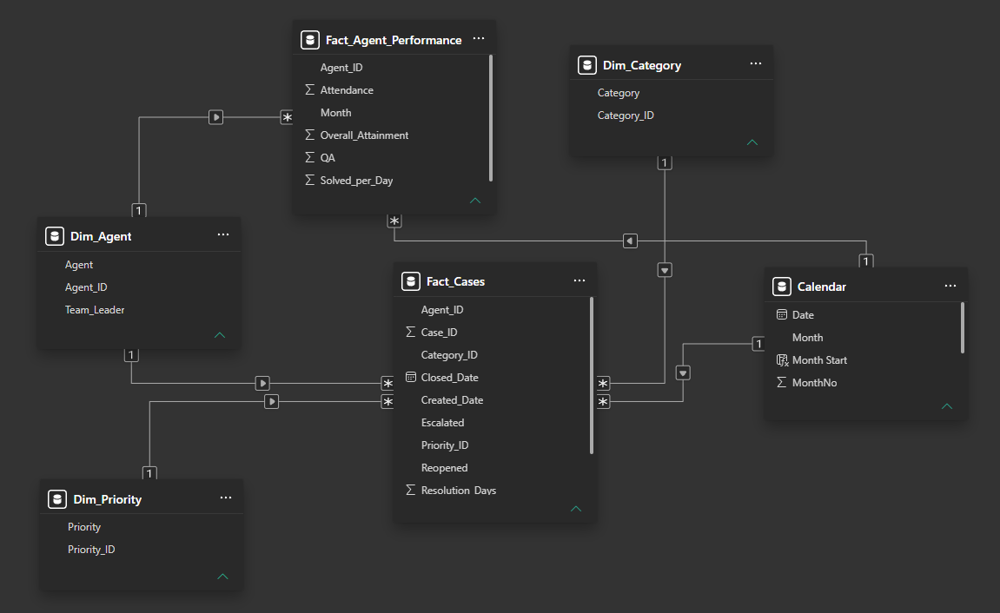

# Customer Support Operations Dashboard

[](https://img.shields.io/badge/Power%20BI-Dashboard-yellow)
[](https://img.shields.io/badge/DAX-Measures-blue)
[](https://img.shields.io/badge/Power%20Query-ETL-green)
[](https://img.shields.io/badge/Data-Analysis-orange)

------------------------------------------------------------------------

## 🎥 Interactive Dashboard Demo

> Explore how interactive filtering by year, month, agent, category, and
> priority dynamically updates customer support KPIs and operational
> metrics across the dashboard.


------------------------------------------------------------------------

## 📸 Dashboard Preview

### Team Overview


### Agent Performance


### Case Operations


------------------------------------------------------------------------

## ⭐ Data Model (Star Schema)

The dashboard follows a **star schema** designed to optimize filtering, improve model performance, and simplify DAX calculations.

<p align="center">
  
</p>

### Model Overview

The solution is built using **two fact tables** and **four dimension tables**, following Power BI dimensional modeling best practices.

#### Fact Tables
- **Fact_Cases** – Stores customer support case information, including resolution time, SLA compliance, priority, category, and reopen status.
- **Fact_Agent_Performance** – Stores monthly agent performance metrics such as QA score, cases solved per day, SLA performance, and attendance.

#### Dimension Tables
- **Calendar** – Date dimension used for time intelligence and report filtering.
- **Dim_Agent** – Agent information.
- **Dim_Category** – Customer support case categories.
- **Dim_Priority** – Priority levels for customer support cases.

This star schema improves report performance, simplifies relationships, and enables efficient cross-filtering across all dashboard pages.

---

## 🧮 DAX Measures

Several custom DAX measures were developed to calculate business KPIs and evaluate customer support performance.

### Overall Performance

```DAX
Weighted Overall Performance =
[QA Attainment] * CALCULATE(
    SELECTEDVALUE(KPI_Targets[Weight]),
    KPI_Targets[KPI] = "QA"
)
+
[Solved Attainment] * CALCULATE(
    SELECTEDVALUE(KPI_Targets[Weight]),
    KPI_Targets[KPI] = "Solved per Day"
)
+
[Reopen Attainment] * CALCULATE(
    SELECTEDVALUE(KPI_Targets[Weight]),
    KPI_Targets[KPI] = "Reopen Rate"
)
+
[SLA Attainment] * CALCULATE(
    SELECTEDVALUE(KPI_Targets[Weight]),
    KPI_Targets[KPI] = "SLA"
)
```

Calculates an overall weighted performance score using KPI targets and configurable business weights.

---

### SLA Compliance

```DAX
SLA Met % =
DIVIDE(
    CALCULATE(
        COUNTROWS(Fact_Cases),
        Fact_Cases[SLA_Met] = "Yes"
    ),
    COUNTROWS(Fact_Cases)
)
```

Measures the percentage of customer support cases resolved within the defined Service Level Agreement (SLA).

---

### Reopen Rate

```DAX
Reopen Rate % =
DIVIDE(
    CALCULATE(
        COUNTROWS(Fact_Cases),
        Fact_Cases[Reopened] = "Yes"
    ),
    COUNTROWS(Fact_Cases)
)
```

Calculates the percentage of support cases reopened after being marked as resolved.

---

### Median Resolution Days

```DAX
Median Resolution Days =
MEDIAN(Fact_Cases[Resolution_Days])
```

Returns the median number of days required to resolve customer support cases, reducing the influence of outliers.

---

### KPI Target Example

```DAX
QA Target =
CALCULATE(
    SELECTEDVALUE(KPI_Targets[Target]),
    KPI_Targets[KPI] = "QA"
)
```

Retrieves KPI targets dynamically from the **KPI_Targets** table, allowing target values to be maintained without modifying DAX code.

---

------------------------------------------------------------------------

## 🎯 Business Objective

Build an interactive Power BI dashboard to monitor customer support
operations by analyzing agent performance, operational efficiency,
service quality, and case trends.

------------------------------------------------------------------------

## ❓ Business Questions Answered

-   How many customer support cases are handled over time?
-   Which agents consistently achieve the highest performance?
-   Are QA, SLA, and productivity targets being met?
-   Which support categories generate the highest workload?
-   Which case categories require the longest resolution time?
-   Which categories have the highest reopen rates?
-   How does SLA compliance vary across different support categories?
-   How does case volume evolve throughout the year?

------------------------------------------------------------------------

## 🚀 Dashboard Features

-   Interactive filtering by year, month, agent, category, and priority
-   KPI cards
-   Weighted KPI attainment
-   Dynamic target lines
-   Multi-page dashboard

------------------------------------------------------------------------

## 📈 Key Performance Indicators

  KPI                    Description
  ---------------------- ---------------------------------
  Overall Performance    Weighted KPI score
  QA Score               Median quality assurance score
  Cases Solved per Day   Median daily resolved cases
  SLA Compliance         Percentage of cases meeting SLA
  Resolution Days        Median resolution days
  Reopen Rate            Percentage of reopened cases

------------------------------------------------------------------------

## 💡 Key Insights

*Update this section after completing the analysis.*

------------------------------------------------------------------------

## 🛠️ Tools & Technologies

-   Power BI
-   Power Query
-   DAX
-   Microsoft Excel

------------------------------------------------------------------------

## 📚 Skills Demonstrated

-   Star Schema Data Modeling
-   Dashboard Design
-   Business Intelligence
-   KPI Development
-   DAX
-   Data Visualization
-   Interactive Reporting

------------------------------------------------------------------------

## 📊 Dashboard Walkthrough

### Executive Overview

High-level KPIs and trends.

### Agent Performance

Individual performance and KPI attainment.

### Case Operations

Case distribution, SLA, resolution time, reopen rate and monthly trends.

------------------------------------------------------------------------

## 🗂️ Data Source

Synthetic customer support dataset created for portfolio purposes.

------------------------------------------------------------------------

## 📈 Business Value

Transforms operational support data into actionable business insights.

------------------------------------------------------------------------

## 🔮 Future Improvements

-   Forecasting
-   CSAT
-   First Response Time
-   Drill-through pages
-   Live Zendesk integration

------------------------------------------------------------------------

## Author

**Daniel Betancourt**

Electronic Engineer \| Data Analyst

-   GitHub: https://github.com/danielbm98
-   LinkedIn: https://www.linkedin.com/in/danielbetancourtmontoya/
